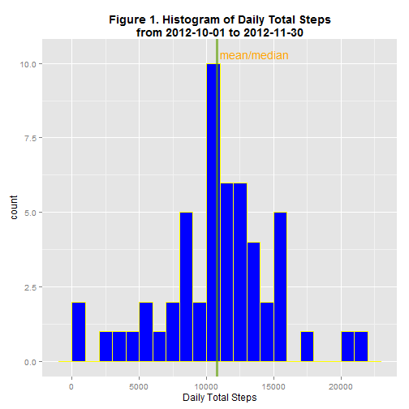
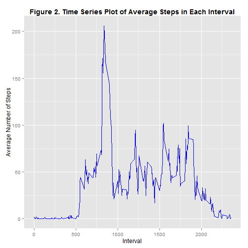
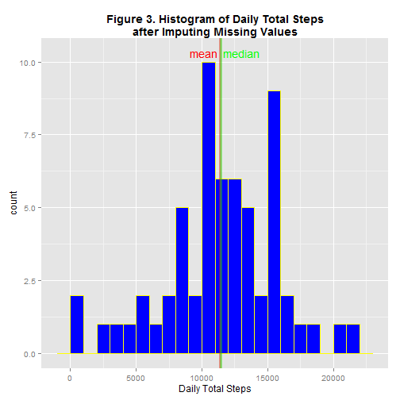
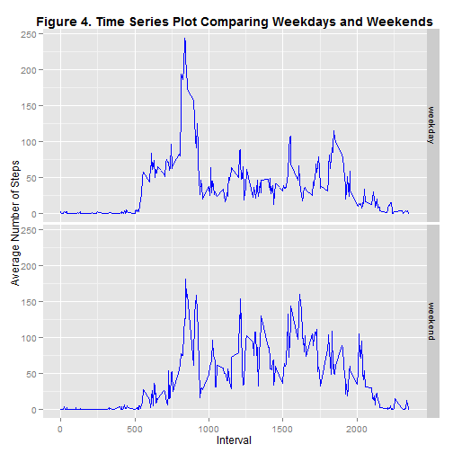

# Reproducible Research: Peer Assessment 1

This is the Rmd file of the Peer Assessment No. 1 for Reproducible Research in Coursera.

The primary objectives of this assignment are:
 1. To read the `activity.csv` file from working directory
 2. To determine total steps taken each day, draw a histogram, and determine mean and median of daily steps.
 3. To draw a time series plot of average steps taken in 5 minute interval across all days, and to determine the 5 minute interval that contains maximum average steps taken.
 4. To determine the missing values and impute the missing values.  Compare the dateset that contains imputed values to the original dataset.
 5. To compare the activities between weekday and weekend.
 
The data was downloaded from the assignment website on June 5, 2014 and unzipped using the following codes:

`fileURL <- "https://d396qusza40orc.cloudfront.net/repdata%2Fdata%2Factivity.zip"`

`download.file(fileURL, dest="activity.zip", method = "auto")`

`unzip("activity.zip")`

I avoid running the code repeatedly to prevent overload of the website.
 
## Loading and preprocessing the data

The following codes read the `activity.csv` file.  Transformation is not necessary at this time to perform the required tasks.

```r
activity <- read.csv("activity.csv", header = T)
summary(activity)
```

```
##      steps               date          interval   
##  Min.   :  0.0   2012-10-01:  288   Min.   :   0  
##  1st Qu.:  0.0   2012-10-02:  288   1st Qu.: 589  
##  Median :  0.0   2012-10-03:  288   Median :1178  
##  Mean   : 37.4   2012-10-04:  288   Mean   :1178  
##  3rd Qu.: 12.0   2012-10-05:  288   3rd Qu.:1766  
##  Max.   :806.0   2012-10-06:  288   Max.   :2355  
##  NA's   :2304    (Other)   :15840
```

## What is mean total number of steps taken per day?

Total activity for each day, mean and median of total activity were calculated.

```r
total.activity <- aggregate(activity$steps, list(activity$date), sum)
names(total.activity) <- c("date", "steps")
head(total.activity)
```

```
##         date steps
## 1 2012-10-01    NA
## 2 2012-10-02   126
## 3 2012-10-03 11352
## 4 2012-10-04 12116
## 5 2012-10-05 13294
## 6 2012-10-06 15420
```

```r
dailymean <- round(mean(total.activity$steps, na.rm = T), digits = 2)
dailymedian <- median(total.activity$steps, na.rm = T)
print(paste("Mean of the total daily activity:", dailymean, "steps."))
```

```
## [1] "Mean of the total daily activity: 10766.19 steps."
```

```r
print(paste("Median of the total daily activity:", dailymedian, "steps."))
```

```
## [1] "Median of the total daily activity: 10765 steps."
```

Draw histogram with `ggplot2`

```r
library(ggplot2)
p1 <- ggplot(total.activity, aes(steps)) + geom_histogram(fill = "blue", color = "yellow", 
    binwidth = 1000)
q1 <- p1 + ggtitle("Figure 1. Histogram of Daily Total Steps\nfrom 2012-10-01 to 2012-11-30") + 
    xlab("Daily Total Steps") + theme(plot.title = element_text(face = "bold")) + 
    geom_vline(xintercept = dailymean, color = "red", alpha = 0.4, size = 1.2) + 
    geom_vline(xintercept = dailymedian, color = "green", alpha = 0.4, size = 1.2) + 
    annotate("text", x = 13600, y = 10.3, label = "mean/median", color = "orange")
print(q1)
```

 

In Figure 1, the red vertical line is mean, and the green vertical line is median.  Because these two values are very close, the lines are superimposed.

## What is the average daily activity pattern?

Average steps taken in each time interval is calculated.  The interval is not continuous.  They represent hour and minute of military time.  There is no interval between 60 and 95.  For example, interval 2005 represent 20:05.

```r
timed.activity <- aggregate(activity$steps, list(activity$interval), mean, na.rm = TRUE)
names(timed.activity) <- c("interval", "steps")
head(timed.activity)
```

```
##   interval   steps
## 1        0 1.71698
## 2        5 0.33962
## 3       10 0.13208
## 4       15 0.15094
## 5       20 0.07547
## 6       25 2.09434
```

```r
timed.activity$interval
```

```
##   [1]    0    5   10   15   20   25   30   35   40   45   50   55  100  105
##  [15]  110  115  120  125  130  135  140  145  150  155  200  205  210  215
##  [29]  220  225  230  235  240  245  250  255  300  305  310  315  320  325
##  [43]  330  335  340  345  350  355  400  405  410  415  420  425  430  435
##  [57]  440  445  450  455  500  505  510  515  520  525  530  535  540  545
##  [71]  550  555  600  605  610  615  620  625  630  635  640  645  650  655
##  [85]  700  705  710  715  720  725  730  735  740  745  750  755  800  805
##  [99]  810  815  820  825  830  835  840  845  850  855  900  905  910  915
## [113]  920  925  930  935  940  945  950  955 1000 1005 1010 1015 1020 1025
## [127] 1030 1035 1040 1045 1050 1055 1100 1105 1110 1115 1120 1125 1130 1135
## [141] 1140 1145 1150 1155 1200 1205 1210 1215 1220 1225 1230 1235 1240 1245
## [155] 1250 1255 1300 1305 1310 1315 1320 1325 1330 1335 1340 1345 1350 1355
## [169] 1400 1405 1410 1415 1420 1425 1430 1435 1440 1445 1450 1455 1500 1505
## [183] 1510 1515 1520 1525 1530 1535 1540 1545 1550 1555 1600 1605 1610 1615
## [197] 1620 1625 1630 1635 1640 1645 1650 1655 1700 1705 1710 1715 1720 1725
## [211] 1730 1735 1740 1745 1750 1755 1800 1805 1810 1815 1820 1825 1830 1835
## [225] 1840 1845 1850 1855 1900 1905 1910 1915 1920 1925 1930 1935 1940 1945
## [239] 1950 1955 2000 2005 2010 2015 2020 2025 2030 2035 2040 2045 2050 2055
## [253] 2100 2105 2110 2115 2120 2125 2130 2135 2140 2145 2150 2155 2200 2205
## [267] 2210 2215 2220 2225 2230 2235 2240 2245 2250 2255 2300 2305 2310 2315
## [281] 2320 2325 2330 2335 2340 2345 2350 2355
```

Finding in which 5-minute interval lies maximal average steps:

```r
a <- timed.activity[timed.activity$steps == max(timed.activity$steps), ]
print(paste("The maximaum of", round(a$steps, digits = 1), "steps is located in the interval", 
    a$interval))
```

```
## [1] "The maximaum of 206.2 steps is located in the interval 835"
```

The interval is **835** (8:35).

The data is plotted with `ggplot2`.

```r
p2 <- ggplot(activity, aes(interval, steps)) + stat_summary(fun.y = mean, geom = "line", 
    color = "blue", na.rm = TRUE)
q2 <- p2 + ggtitle("Figure 2. Time Series Plot of Average Steps in Each Interval") + 
    theme(plot.title = element_text(face = "bold")) + ylab("Average Number of Steps") + 
    xlab("Interval")
print(q2)
```

 


## Imputing missing values

Finding where the `NA`s are:

```r
table(activity$date, is.na(activity$steps))
```

```
##             
##              FALSE TRUE
##   2012-10-01     0  288
##   2012-10-02   288    0
##   2012-10-03   288    0
##   2012-10-04   288    0
##   2012-10-05   288    0
##   2012-10-06   288    0
##   2012-10-07   288    0
##   2012-10-08     0  288
##   2012-10-09   288    0
##   2012-10-10   288    0
##   2012-10-11   288    0
##   2012-10-12   288    0
##   2012-10-13   288    0
##   2012-10-14   288    0
##   2012-10-15   288    0
##   2012-10-16   288    0
##   2012-10-17   288    0
##   2012-10-18   288    0
##   2012-10-19   288    0
##   2012-10-20   288    0
##   2012-10-21   288    0
##   2012-10-22   288    0
##   2012-10-23   288    0
##   2012-10-24   288    0
##   2012-10-25   288    0
##   2012-10-26   288    0
##   2012-10-27   288    0
##   2012-10-28   288    0
##   2012-10-29   288    0
##   2012-10-30   288    0
##   2012-10-31   288    0
##   2012-11-01     0  288
##   2012-11-02   288    0
##   2012-11-03   288    0
##   2012-11-04     0  288
##   2012-11-05   288    0
##   2012-11-06   288    0
##   2012-11-07   288    0
##   2012-11-08   288    0
##   2012-11-09     0  288
##   2012-11-10     0  288
##   2012-11-11   288    0
##   2012-11-12   288    0
##   2012-11-13   288    0
##   2012-11-14     0  288
##   2012-11-15   288    0
##   2012-11-16   288    0
##   2012-11-17   288    0
##   2012-11-18   288    0
##   2012-11-19   288    0
##   2012-11-20   288    0
##   2012-11-21   288    0
##   2012-11-22   288    0
##   2012-11-23   288    0
##   2012-11-24   288    0
##   2012-11-25   288    0
##   2012-11-26   288    0
##   2012-11-27   288    0
##   2012-11-28   288    0
##   2012-11-29   288    0
##   2012-11-30     0  288
```


The all-day data from the dates 2012-10-01, 2012-10-08, 2012-11-01, 2012-11-04, 2012-11-09, 2012-11-10, 2012-11-14, and 2012-11-30 are `NA`s.  There are a total of **2304** `NA`s.

To impute missing values, I created a data frame of mean and standard deviation for each interval.  The missing values were imputed by random number generated from mean and standard deviation for the interval.

```r
sd.activity <- tapply(activity$steps, as.factor(activity$interval), sd, na.rm = TRUE)
meansd <- cbind(timed.activity, sd.activity)
names(meansd) <- c("interval", "mean", "sd")
```

The following function will take in the interval of the missing value, convert the interval to row number, and generate random number with reference to mean and standard deviation from the `meansd` table.  Because the steps cannot be negative, if the generated random number is a negative number, the value is assigned as 0.

```r
imputeNA <- function(interval) {
    a <- interval%/%100
    b <- interval%%100
    rownum <- a * 12 + b/5 + 1
    c <- round(rnorm(1, mean = meansd[rownum, 2], sd = meansd[rownum, 3]))
    if (c < 0) {
        c <- 0
    }
    return(c)
}
```

The following codes will create dataset `activity2` from `activity`.  If the data is missing, it will create the data using `imputeNA` function.  If the data is not missing, it will simply copy the data from `activity`.

```r
activity2 <- data.frame(steps = numeric(), date = as.Date(character()), interval = numeric())
n <- nrow(activity)
set.seed(123456)
for (i in 1:n) {
    if (is.na(activity[i, 1])) {
        activity2[i, 1] <- imputeNA(activity[i, 3])
        activity2[i, 2:3] <- activity[i, 2:3]
    } else {
        activity2[i, 1:3] <- activity[i, 1:3]
    }
}
summary(activity2)
```

```
##      steps            date               interval   
##  Min.   :  0.0   Min.   :2012-10-01   Min.   :   0  
##  1st Qu.:  0.0   1st Qu.:2012-10-16   1st Qu.: 589  
##  Median :  0.0   Median :2012-10-31   Median :1178  
##  Mean   : 39.6   Mean   :2012-10-31   Mean   :1178  
##  3rd Qu.: 19.0   3rd Qu.:2012-11-15   3rd Qu.:1766  
##  Max.   :806.0   Max.   :2012-11-30   Max.   :2355
```

Now the dataset `activity2` no longer has `NA`s.  The dataset is saved as `activity2.csv` in the working directory.

```r
write.csv(activity2, "activity2.csv", row.names = FALSE)
```

Average daily steps are recalculated using `activity2` and the data is plotted with `ggplot2` and compared side by side with `Figure 1`.

```r
total.activity2 <- aggregate(activity2$steps, list(activity2$date), sum)
names(total.activity2) <- c("date", "steps")
dailymean2 <- round(mean(total.activity2$steps), digits = 2)
dailymedian2 <- median(total.activity2$steps)
print(paste("Mean of the new total daily activity:", dailymean2, "steps."))
```

```
## [1] "Mean of the new total daily activity: 11417.28 steps."
```

```r
print(paste("Median of the new total daily activity:", dailymedian2, "steps."))
```

```
## [1] "Median of the new total daily activity: 11458 steps."
```

As a result of imputing the missing values, both mean and median of daily total steps slightly increase, but the 2 values are still very close.  The median is slightly higher than mean.  It appeared that the imputation assigned around 15000 daily steps in the dates with missing values.  As a result, there is a tall peak around 15000 steps, which shifted the mean and median.  The following is the histogram of daily total steps using the new dataset.

```r
p3 <- ggplot(total.activity2, aes(steps)) + geom_histogram(fill = "blue", color = "yellow", 
    binwidth = 1000)
q3 <- p3 + ggtitle("Figure 3. Histogram of Daily Total Steps\nafter Imputing Missing Values") + 
    xlab("Daily Total Steps") + theme(plot.title = element_text(face = "bold")) + 
    geom_vline(xintercept = dailymean2, color = "red", alpha = 0.4, size = 1.2) + 
    geom_vline(xintercept = dailymedian2, color = "green", alpha = 0.4, size = 1.2) + 
    annotate("text", x = c(10200, 13000), y = 10.3, label = c("mean", "median"), 
        color = c("red", "green"))
print(q3)
```

 


## Are there differences in activity patterns between weekdays and weekends?

Adding a column `wd` to separate weekday from weekend.  I use `weekdays()` to find the day of the week.  If the result is "Sat" or "Sun", weekend is assigned.  Otherwise, weekday is assigned.

```r
activity2$wd <- ifelse(weekdays(activity2$date, abbreviate = TRUE) %in% c("Sat", 
    "Sun"), "weekend", "weekday")
```

The time series plot of average steps is drawn using `ggplot2` with `weekday` and `weekend` separated out by `facet_grid`.

```r
p4 <- ggplot(activity2, aes(interval, steps))
q4 <- p4 + stat_summary(fun.y = mean, geom = "line", color = "blue") + facet_grid(wd ~ 
    .) + ggtitle("Figure 4. Time Series Plot Comparing Weekdays and Weekends") + 
    theme(plot.title = element_text(face = "bold")) + xlab("Interval") + ylab("Average Number of Steps")
print(q4)
```

 

The plot showed that in the weekdays, there is a peak around interval 835 with increased activity from interval 500.  In the weekends, the activity was spreaded out 750 to 2100.


